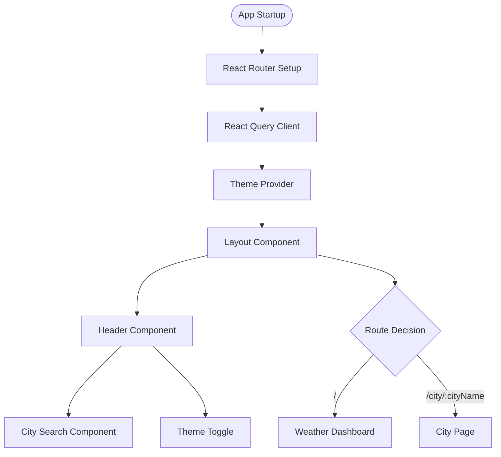
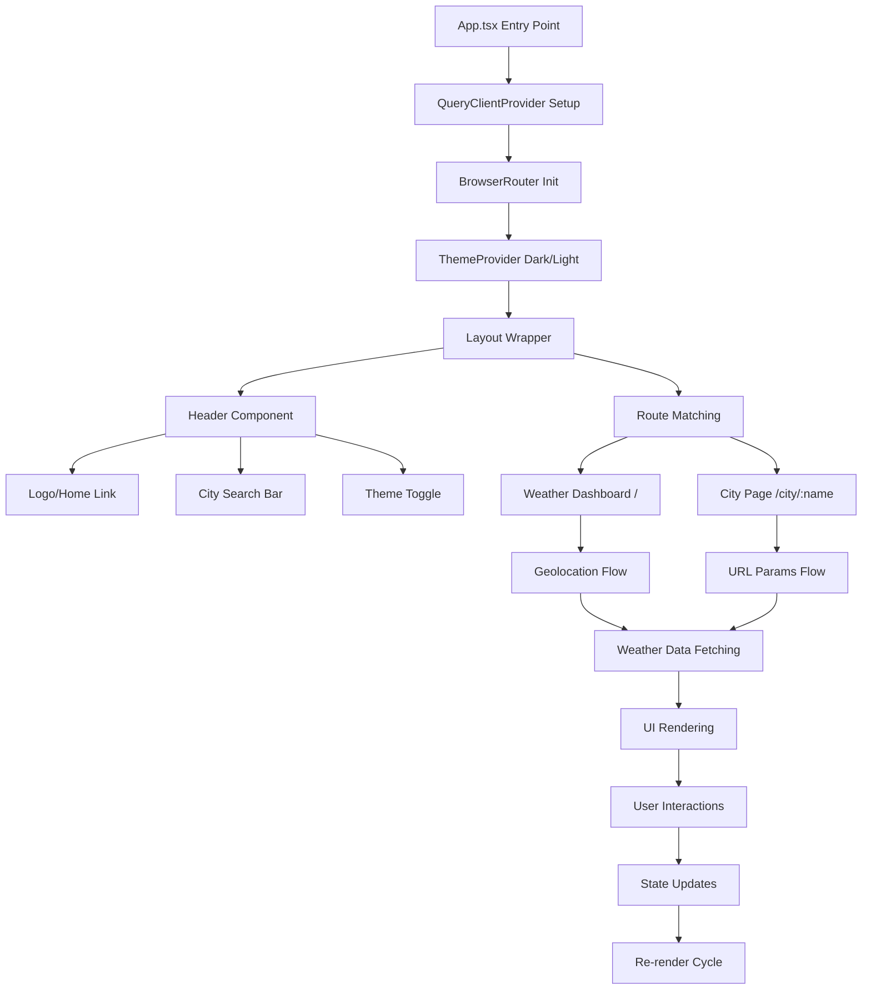
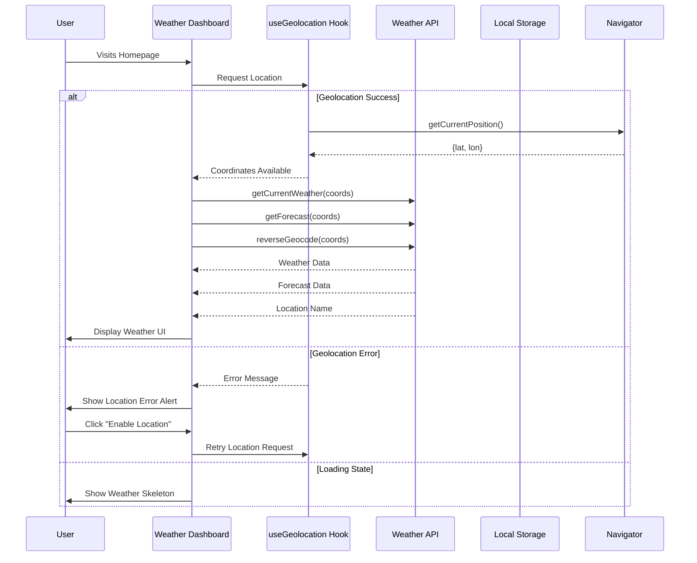
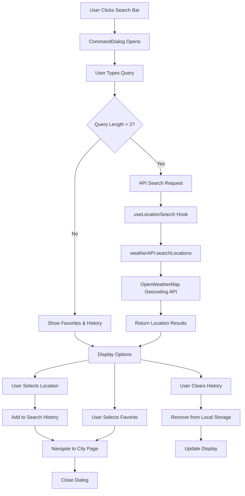
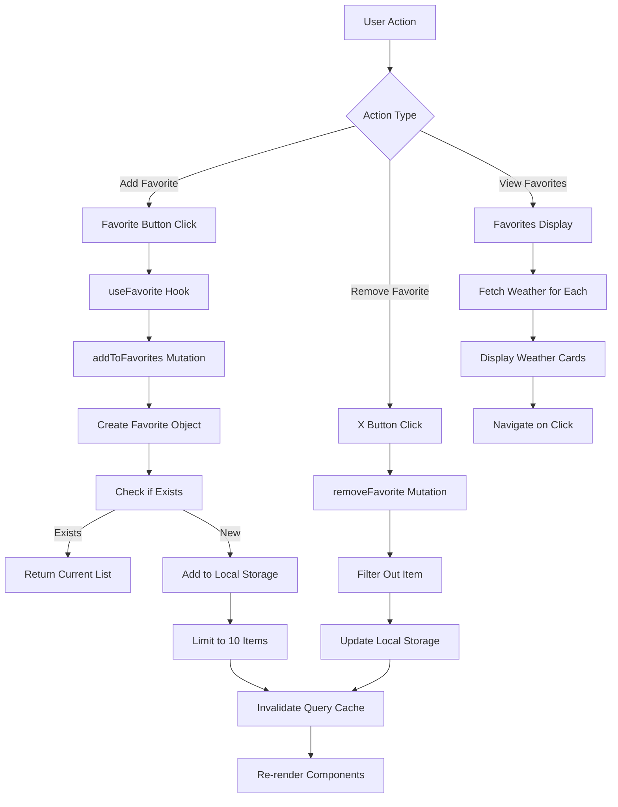
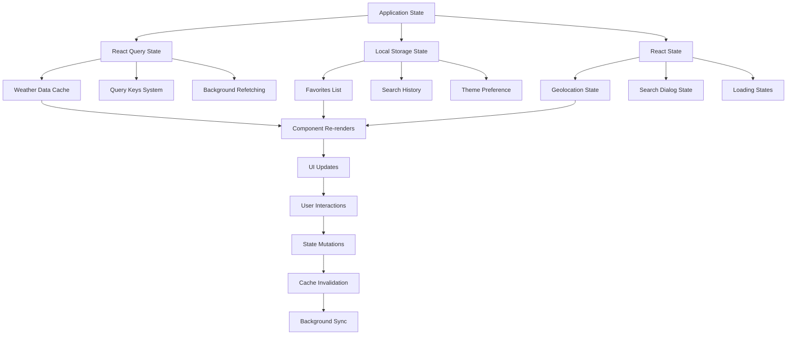
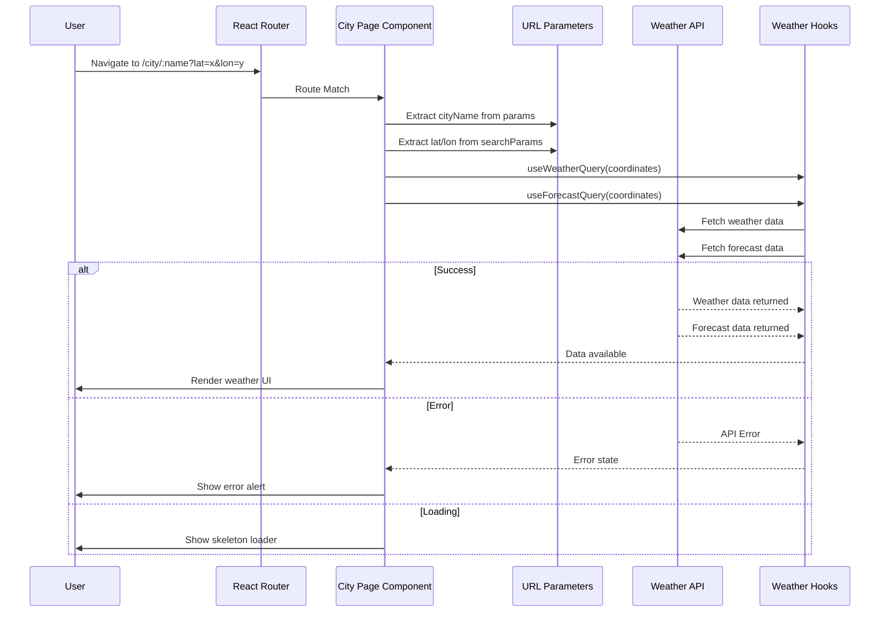
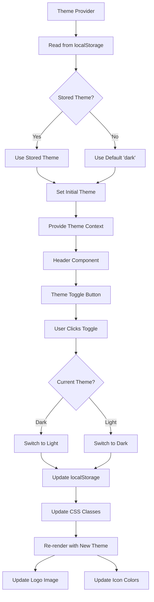
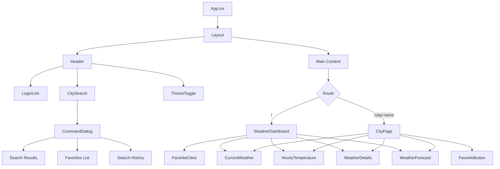

# SkyPulse Weather App - Complete Flow Diagram

## Overview
SkyPulse is a React-based weather application that provides current weather, forecasts, and location-based weather services with geolocation, city search, and favorites management.

---

## Application Architecture Flow



---

## Main Application Flow



---

## Geolocation & Weather Dashboard Flow



---

## City Search Flow



---

## Favorites Management Flow



---

## API Integration Flow

```mermaid
flowchart LR
    A[Weather Requests] --> B[WeatherAPI Class]
    
    B --> C[createUrl Method]
    C --> D[Add API Key & Params]
    D --> E[fetchData Method]
    
    E --> F{API Endpoint}
    
    F -->|Current Weather| G[/weather endpoint]
    F -->|5-Day Forecast| H[/forecast endpoint]
    F -->|Reverse Geocode| I[/reverse endpoint]
    F -->|City Search| J[/direct endpoint]
    
    G --> K[OpenWeatherMap API]
    H --> K
    I --> K
    J --> K
    
    K --> L[HTTP Response]
    L --> M{Response OK?}
    
    M -->|Yes| N[Return JSON Data]
    M -->|No| O[Throw Error]
    
    N --> P[React Query Cache]
    O --> Q[Error Handling]
```

---

## State Management Flow



---

## City Page Flow



---

## Theme Management Flow



---

## Error Handling Flow

```mermaid
graph TD
    A[Application Errors] --> B{Error Type}
    
    B -->|Geolocation Error| C[Location Permission Issues]
    B -->|API Error| D[Weather API Failures]
    B -->|Network Error| E[Connection Problems]
    
    C --> F[Show Location Error Alert]
    F --> G[Provide "Enable Location" Button]
    G --> H[Retry Geolocation]
    
    D --> I[Show Weather Error Alert]
    I --> J[Provide "Retry" Button]
    J --> K[Refetch Weather Data]
    
    E --> L[React Query Retry Logic]
    L --> M{Retry Successful?}
    
    M -->|Yes| N[Display Data]
    M -->|No| O[Show Error State]
    
    H --> P[Update UI State]
    K --> P
    N --> P
    O --> P
```

---

## Component Hierarchy



---

## Key Features Summary

### 🌍 **Geolocation Services**
- Automatic location detection
- Manual location permission requests
- Error handling for location failures

### 🔍 **City Search**
- Real-time city search with OpenWeatherMap Geocoding
- Search history persistence
- Favorites integration
- Recent searches display

### ⭐ **Favorites Management**
- Add/remove favorite cities
- Local storage persistence
- Weather previews for favorites
- Quick navigation to favorite cities

### 🌤️ **Weather Data**
- Current weather conditions
- 5-day forecast
- Hourly temperature charts
- Detailed weather metrics

### 🎨 **UI/UX Features**
- Dark/Light theme switching
- Responsive design
- Loading skeletons
- Error states with retry options
- Toast notifications

### 🔄 **State Management**
- React Query for server state
- Local storage for user preferences
- Automatic cache invalidation
- Background data refetching

---

This flow diagram represents the complete architecture and user journey through your SkyPulse weather application, showing how all components interact and data flows through the system.